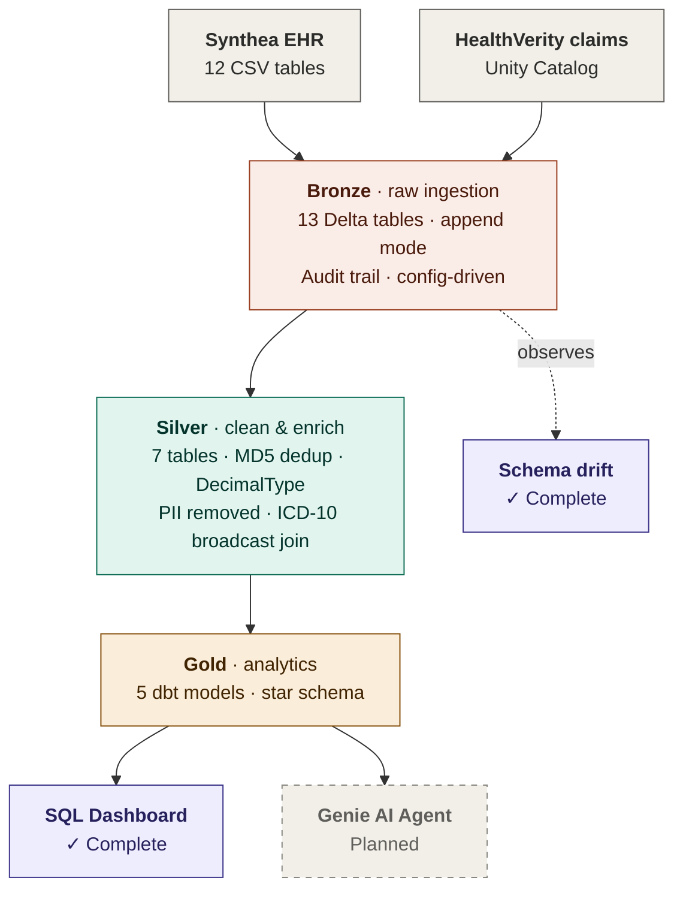

# EHR Medallion Pipeline

End-to-end healthcare data pipeline on Databricks using Medallion architecture (Bronze → Silver → Gold), built with PySpark and dbt. Ingests synthetic EHR data from two independent sources, cleans and enriches it through Silver, and produces analytical Gold tables for dashboards and AI agents.

## Architecture



## Tech Stack

**Platform**


**Languages**


**Tools**


**Workflow**


**Data sources:** Synthea EHR (12 CSV tables) · HealthVerity claims (Unity Catalog)

**Approach:** Bronze/Silver → PySpark modules · Gold → dbt SQL models · Same repo, two engines

## Project Structure

```
ehr-medallion-pipeline/
├── docs/
│   ├── decisions.md              # Architecture decision log
│   └── issues.md
├── ehr_medallion_pipeline/
│   ├── config/
│   │   └── dev.yml               # Environment config (catalog, paths)
│   ├── gold/                     # dbt project
│   │   ├── models/
│   │   │   └── gold/
│   │   │       ├── _sources.yml  # Silver table references
│   │   │       ├── patient_summary.sql
│   │   │       ├── encounter_summary.sql
│   │   │       ├── condition_prevalence.sql
│   │   │       ├── provider_metrics.sql
│   │   │       └── readmission_risk.sql
│   │   └── dbt_project.yml
│   ├── src/
│   │   └── ehr_medallion_pipeline/
│   │       ├── bronze/
│   │       │   ├── ingest_synthea.py
│   │       │   └── ingest_healthverity.py
│   │       ├── silver/
│   │       │   ├── transform_patients.py
│   │       │   ├── transform_encounters.py
│   │       │   ├── transform_conditions.py
│   │       │   ├── transform_medications.py
│   │       │   ├── transform_observations.py
│   │       │   ├── transform_procedures.py
│   │       │   └── transform_hv_claims.py
│   │       └── utils/
│   └── tests/
└── README.md
```

## Development Workflow

Feature branch per GitHub Issue → PR → merge → delete branch. Commit messages auto-close issues (`closes #N`). Branch naming: `feat/`, `fix/`, `docs/`, `chore/`. Local dev in VSCode, synced to Databricks Repos via GitHub.

## Data Pipeline Detail

### Bronze Layer (Complete)

Raw ingestion with full audit trail. All tables land in `ehr_pipeline.bronze`.


| Table | Rows | Source |
|-------|------|--------|
| synthea_patients | 11,737 | Synthea CSV |
| synthea_encounters | 393,234 | Synthea CSV |
| synthea_conditions | 84,421 | Synthea CSV |
| synthea_medications | 109,121 | Synthea CSV |
| synthea_observations | 2,181,850 | Synthea CSV |
| synthea_procedures | 327,171 | Synthea CSV |
| + 6 more Synthea tables | — | Synthea CSV |
| hv_claims_raw | 409,825 | Unity Catalog |

### Silver Layer (Complete)

Cleaned, typed, deduplicated, and enriched. All tables in `ehr_pipeline.silver`.

| Table | Rows | Key Transformations |
|-------|------|---------------------|
| synthea_patients | 11,737 | PII dropped (SSN, drivers, passport), age derived, marital decoded |
| synthea_encounters | 393,234 | Timestamps cast, duration_minutes derived, partitioned by year/month |
| synthea_conditions | 84,421 | Dates cast, dedup via window function |
| synthea_medications | 109,121 | MD5 surrogate key, cost cast, dedup via window |
| synthea_observations | 2,181,850 | Numeric/text observation split, units standardized |
| synthea_procedures | 327,171 | Dates cast, MD5 surrogate key, dedup via window |
| hv_claims_clean | 327,788 | DecimalType for money, ICD-10 broadcast join, NPI validation, cost_reduction derived |

**Silver HealthVerity enrichments:**
- `diagnosis_category` — ICD-10 first character decoded via broadcast join (25-row lookup, no shuffle)
- `cost_reduction` — billed minus allowed amount
- `claim_type_decoded` — P → Professional, I → Institutional
- `is_valid_npi` — regex validation (`^\d{10}$`)
- `DecimalType(10,2)` for monetary columns to avoid floating-point precision drift

### Gold Layer (Complete)

Analytical aggregates built with dbt, materialized as Delta tables in `ehr_pipeline.gold`.

| Model | Grain | Status |
|-------|-------|--------|
| patient_summary | 1 row per patient | ✅ Complete |
| encounter_summary | 1 row per encounter-condition | ✅ Complete |
| condition_prevalence | 1 row per condition code | ✅ Complete |
| provider_metrics | 1 row per provider | ✅ Complete |
| readmission_risk | 1 row per encounter | ✅ Complete |

**Design decisions:**
- PySpark for Bronze/Silver (complex ingestion, window functions, programmatic control)
- dbt for Gold (SQL models with lineage, documentation, and testing)
- CTE pattern to avoid fan-out from multi-fact joins
- Left joins to preserve all patients regardless of encounter/condition history

## Key Engineering Patterns

**Idempotent ingestion** — Bronze uses merge with fallback to overwrite on first run, ensuring safe re-runs.

**Deterministic dedup** — Window functions with `row_number()` ordered by `_ingested_at DESC`, always keeping the latest record. Never `dropDuplicates()` (no control over which row survives).

**Surrogate keys** — MD5 hash on composite natural keys when no single primary key exists (e.g., `claim_id + service_line_number + diagnosis_code`).

**Broadcast joins** — Small lookup tables (like ICD-10 category mapping) broadcast to all executors to avoid expensive shuffles.

**DecimalType over float/double** — Fixed-point arithmetic for monetary columns to prevent precision drift in aggregations.

**PII protection** — SSN, drivers license, passport dropped in Silver. Maiden name excluded from Gold. No PII in analytical tables.

**Schema drift detection** — Baseline schema captured in Delta registry table. On each run, current schema compared via set operations (left_anti joins). Three drift types detected: columns added, removed, or type changed. Drift events logged with timestamps for audit.

## Running the Pipeline

### Prerequisites
- Databricks workspace with Unity Catalog enabled
- Python 3.10+, dbt-databricks installed
- Personal access token configured

### Bronze + Silver (PySpark)

```python
# In a Databricks notebook
from ehr_medallion_pipeline.bronze.ingest_synthea import run_full_ingestion
from ehr_medallion_pipeline.silver.transform_patients import transform_patients

run_full_ingestion(spark, env="dev")
transform_patients(spark, env="dev")
```

### Gold (dbt)

```bash
cd ehr_medallion_pipeline/gold
dbt run --target dev
dbt test --target dev
```

## Dashboard

Databricks SQL dashboard built over Gold layer tables.


## Roadmap

- [x] Complete Gold dbt models (encounter_summary, condition_prevalence, provider_metrics, readmission_risk)
- [x] Databricks SQL dashboard over Gold tables
- [x] Schema drift detection on Bronze layer
- [ ] Genie AI agent for natural language queries over Gold
- [ ] dbt tests and documentation for Gold models

## License

MIT
